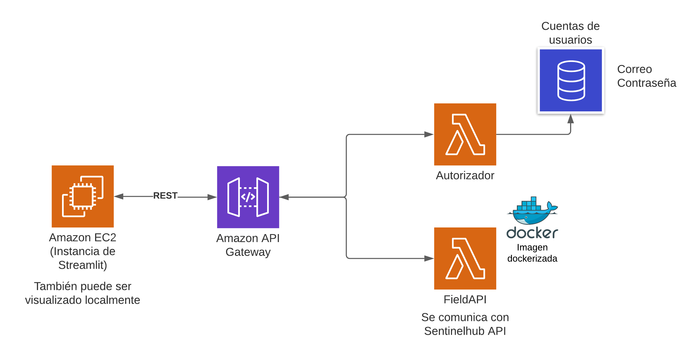

<h2 align="center"><br><strong>FieldAPI</strong></h2>

<p align="center"><strong>API de análisis de parcelas</strong></p>

FieldAPI es una API hecha en Python que recupera la data del campo de los agricultores desde la base de datos de AGROS, a través de consultas realizadas hacia SentinelHub. 

- ℹ️ Realiza consultas REST hacia un API Gateway de AWS.
- 🔓 Autoriza a los usuarios registrados el acceso hacia la API en la nube.
- 🐳 Contiene la API completa en un contenedor Docker.
- 🍃 Visualización a través de dashboard en Streamlit.

<details>
<summary><strong>Tabla de Contenidos</strong> (dar click para expandir)</summary>

- [⚙️ Desarrollo](#desarrollo)
    - [Esquema general](#esquema-general)
    - [Dashboard en Streamlit](#dashboard-en-streamlit)
    - [Consultas iniciales en FastAPI](#consultas-iniciales-en-fastapi)
    - [Consultas con controlador del Lambda](#consultas-con-controlador-del-lambda)
    - [Imagen con contenedor Docker](#imagen-con-contenedor-docker)
    - [Integracion en aws](#integracion-en-aws)
    - [Seguridad con Cognito](#seguridad-con-cognito)
- [🧰️ Instalación y uso](#-instalacion-y-uso)
- [💡 Mejoras y comentarios](#-mejoras-y-comentarios)

</details>


## ⚙️ Desarrollo

### Esquema general

<p align="center"></p>

La API fue diseñada para que esté disponible en todo momento, sin necesidad de usar un servidor local o propio en la nube. Para ello, se usa la tecnología serverless, la cual permite que la aplicación este disponible en todo momento y el costo de su mantenimiento sea reducido a las anteriormente mencionadas.

Al realizar la consulta, lo que se obtiene de SentinelHub son los paramétros de salud y de NDVI del campo del agricultor consultado. El paramétro de salud toma en cuenta componentes cómo el nivel de pH y nutrientes del suelo del campo, los cuales indican que tan protegidos están estos ante plagas o maleza y es un indicativo de una buena producción. Por otra parte, el paramétro Índice de vegetación de diferencia normalizada o NDVI (en inglés) determina la calidad de la vegetación del campo mediante sensores de radiación. A través de ello, se puede determinar si, en promedio, la calidad de la producción del campo del productor.

### Consultas iniciales en FastAPI

El funcionamiento del programa localmente se realizó usando [FastAPI](https://fastapi.tiangolo.com/), el cual es un framework de Python usado para hacer consultas rápidas. La ventaja de usar FastAPI es que se puede visualizar las consultas realizadas a través de Swagger UI, el cual es una interface sencilla en donde se prueban los métodos HTTP pertenecientes a la instancia. En el caso de la API, esta pedirá la data del campo del usuario, teniendo como variable de entrada su nombre.

### Consultas con controlador del Lambda

Uno de los servicios que ofrece Amazon Web Service son los [Lambdas](https://aws.amazon.com/lambda/), los cuales permite correr código utilizando el servidor de Amazon. Esto permite subir código con rapidez al contar con un servicio disponible y extensible, en donde solo se paga por el tiempo de ejecución del la función. 

La funcionalidad de las consultas es muy similar a FastAPI, por lo que solo se debieron cambiar ciertos aspectos para poder realizar la consulta debidamente. Para poder empaquetar las bibliotecas necesarias del código, lo primero que se sugiere es crear capas (layers) en donde se suban estas bibliotecas de manera zipeada. Es este ejemplo se incluyeron:


| Biblioteca | Version |
| ---------- | ----- |
| SentinelHub | 3.4.2 |
| Pyproj | 3.3.0 |
| Pandas | 1.3.4 |
| Geopandas | 0.10.2 |
| Scipy | 1.7.3 |


Lamentablemente, las capas tienen un límite de tamaño de 250MB al desplegar el código en la nube, lo cual es inconveniente para la API bibliotecas pesadas. Para ello, es necesario usar un contenedor.

### Imagen con contenedor Docker

Es uso de contenedores [Docker](https://www.docker.com/) es una alternativa más sencilla y económica a usar un ambiente virtual como Amazon EC2. La capacidad de los contenedores es de 10GB para desplegar el código, por lo que es necesario su uso. Para ello se necesita un archivo Docker (Dockerfile) para poder dar instrucciones al contenedor una vez se construya y para que incluya todo lo que necesita la aplicación. 

Una vez se construya el Docker, este tendrá que ser probado localmente, ya sea con el comando de transferencia de URLs (curl) o mediante algún programa que realice la consulta. Al tener el código en orden, este será subido cómo función Lambda mediante usando la línea de comando de AWS. Para cual quier cambio en el archivo Docker, se necesitará realizar este proceso otra vez, con otro "tag", el cual identifica la versión de la imagen contenida.

### Integracion en AWS

Para poder realizar consultas a la función Lambda del API, es necesario agregar un API Gateway, el cual permite crear los métodos de consultas usados pos el controlador de la función Lambda. Para el caso de fieldAPI, se agregó el método GET y se comprobó su funcionamiento usando [Postman](https://www.postman.com/). Para ello, se pasó un cuerpo (body) de consulta JSON con el nombre del usuario y se recibió como respuesta el cuerpo de salida, el cual incluye el nombre del usuario, la geometría del campo y un diccionario con los índices de salud y de NDVI del campo. 

Cuerpo de entrada de la consulta:
```json
{
    "username":"Rosa_Nima"
}
```

Cuerpo de salida de la consulta:
```json
{
    "name": "Rosa_Nima",
    "geometry": {
        "type": "Polygon",
        "coordinates": [
            [
                [
                    -80.1625724469252,
                    -5.107486273872063
                ],
                ...
                [
                    -80.1625724469252,
                    -5.107486273872063
                ]
            ]
        ]
    },
    "index": {
        "NDVI_yearly_index": -2.894537818230761,
        "NDVI_slope": 0.05274378859151807,
        "NDVI_last": 0.3420722947931998,
        "health_yearly_index": -5.471947818234261,
        "health_slope": 11.735762345422653,
        "health_last": 47.31402738381235
    }
}
```

### Seguridad con Cognito

Una vez la aplicación este integrada, cualquier persona puede tener acceso a ella, lo cual no es muy seguro para el código. Para ello, se necesita regular el grupo de usuarios que tendrían permiso de usar la API. Para ello, se usó Amazon Cognito que permite agregar usuarios para cierto servicio, ofreciendoles acceso por un tiempo determinado (acceso dinámico).

El grupo de usuarios creado puede asimilarse a una base de datos en donde se almacenan los usuarios por un tiempo determinado (en el caso de fieldAPI, son 7 días desde la creación de una cuenta). Una vez se accede a la cuenta, se tendrá que usar el token de acceso del usuario para poder ingresar a la aplicación (este tendrá que ser recibido manualmente cómo parámetro de cabeza (header) de autorización al realizar la consulta.

Al comprobar que la consulta funcione en Postman, se puede integrar el fragmento de código que este ofrece para poder realizar la consulta dentro de alguna aplicación (para fieldAPI se usó la biblioteca Requests de Python dentro de la aplicación del Dashboard). Nótese que la autorización para cada usuario solo dura un día, por lo que se tendrá que cambiar el parámetro otra vez al transcurrir las 24 horas).

### Dashboard en Streamlit

El dashboard se realizó con el objetivo de mostrar la información de manera clara, tomando en cuenta las primeras impresiones del usuario. Para ello, se usó la biblioteca [Streamlit](https://streamlit.io/), la cual permite el desarrollo de un dashboard sencillo y ligero. Cómo esta es una biblioteca enfocada a la rapidez de la realización, es fácil de integrar pero tiene limitaciones al momento de personalizar la aplicación.

<p align="center">
  
</p>

## 🧰️ Instalación y uso

- Preliminarmente, se recomienda instalar Python en el sistema operativo que se use. Se recomienda usar mínimo Python 3.6.
- Se necesitará clonar o descargar el código del repositorio:
```
git clone https://github.com/Avicr01/AGROS_fieldAPI.git
```
- Al estar dentro del repositorio clonado, utilizar el siguiente comando para descargar todas las bibliotecas de Python necesarias para correr la aplicación. De manera alterna, se pueden descargar las bibliotecas una por una manualmente.
```
pip install -r requirements.txt
```
- Entrar a la página de [registro de usuarios de fieldAPI](https://fieldapi.auth.us-west-1.amazoncognito.com/login?client_id=3ua2b79phjif15c5qidico2a83&response_type=code&scope=aws.cognito.signin.user.admin+email+openid+phone+profile&redirect_uri=https://example.com/callback) y registrarse. 
- Una vez se registre correctamente, ingresar a la [siguiente URL](https://fieldapi.auth.us-west-1.amazoncognito.com/login?client_id=3ua2b79phjif15c5qidico2a83&response_type=token&scope=aws.cognito.signin.user.admin+email+openid+phone+profile&redirect_uri=https://example.com/callback) y copiar el URL dentro del archivo token-url.txt (tal cómo se muestra en el archivo).
      
- Correr el aplicativo dentro de la carpeta "src" usando el siguiente comando:
```
streamlit run app.py
```

## 💡 Mejoras y comentarios 

- La data de los agricultores podría ser almacenada usando una base de datos dentro de la nube (Amazon S3), ya que esta podría ser extendida independientemente del la imagen de la aplicación.
- El funcionamiento de la API podría ser replicado para integrarse con otras API de data satelital. 
- El manejo de los tokens de los usuarios registrados podría ser automático una vez este ingrese a su cuenta (evento inmediato luego de ingresar).
- Las imágenes de los mapas podrían ser obtenidas de FastAPI y sobrepuestas para una mejor visualización. La visualización que ofrece Plotly con Mapbox y otras alternativas tienen un alcance limitado y/o son de pago.

